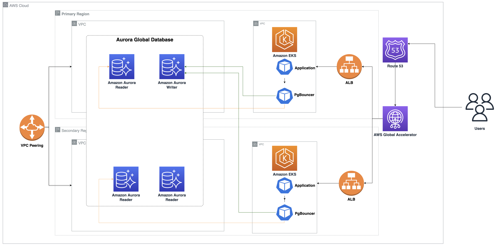

# Blog content for Scaling Applications using Multi Region Amazon EKS Clusters and Aurora Global Database

## Architecture

This solution deploys Amazon EKS clusters in two regions, Application, PgBouncer on EKS in both regions and Amazon Aurora Global Database. 

We configure both regions to be active-active using the local read and global write design pattern. We start by creating an [Amazon EKS](https://aws.amazon.com/eks/) cluster and [Aurora Global Database](https://aws.amazon.com/rds/aurora/global-database/) with PostgreSQL compatibility in regions `us-east-2` and `us-west-2`. We use [PgBouncer](https://www.pgbouncer.org/features.html) for database connection pooling, which is an open-source connection pooling solution for PostgreSQL. We also implement a workflow using [Amazon EventBridge](https://aws.amazon.com/eventbridge/) for PgBouncer to handle planned Aurora Global Database failover. We then deploy the application stack, which includes stateless containerized applications on Amazon EKS clusters in both regions. We then expose the application endpoint using an [Application Load Balancer](https://docs.aws.amazon.com/elasticloadbalancing/latest/application/introduction.html) in the respective Regions. Finally, we configure [AWS Global Accelerator](https://aws.amazon.com/global-accelerator) for the Load Balancers as endpoints

## Deployment

Please refer to [Blog - Scale applications using multi-Region Amazon EKS and Amazon Aurora Global Database](https://aws.amazon.com/blogs/database/part-1-scale-applications-using-multi-region-amazon-eks-and-amazon-aurora-global-database/) for details.

## Security

See [CONTRIBUTING](CONTRIBUTING.md#security-issue-notifications) for more information.

## License

This library is licensed under the MIT-0 License. See the LICENSE file.
